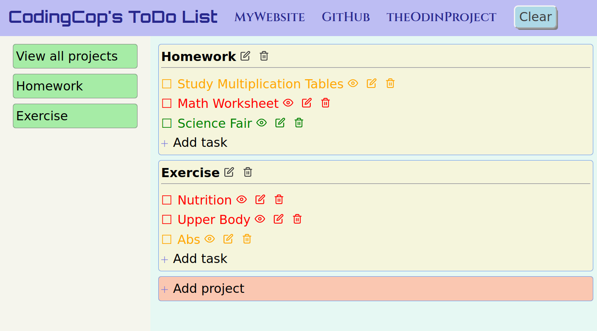

HTML/CSS/JavaScript ToDo List Manager

Manage your complex To-Do lists by creating groups of tasks called projects. My app uses JavaScript to enable various features, such as color-coded priority, and clicking to select which project you want to view. [ToDo List Manager](https://htmlpreview.github.io/?https://github.com/cleve703/todo/blob/main/dist/index.html. Check out the GitHub repository at [GitHub](https://github.com/cleve703/todo).

## Purpose

I completed this project as part of the full-stack web development curriculum at [theOdinProject](https://theodinproject.org), in order to learn and demonstrate my proficiency in the use of JavaScript. Specifically, this project focuses on using modules, factory functions, and localStorage.

## Built With

* HTML5
* CSS3
* JavaScript

## Project Status

As of May 25, 2021, I have completed the assignment to meet or exceed the specified requirements. However, in the future I may revisit it, in order to refine the appearance and add more functionality, such as highlighting overdue tasks and other view customizations.

## About Me

* My name: Jay Conner
* My website: [CodingCop](https://codingcop.com)
* My Twitter: [@JayConner17](https://twitter.com/JayConner17)
* My LinkedIn: [LinkedIn](https://www.linkedin.com/in/jay-c-8000196)